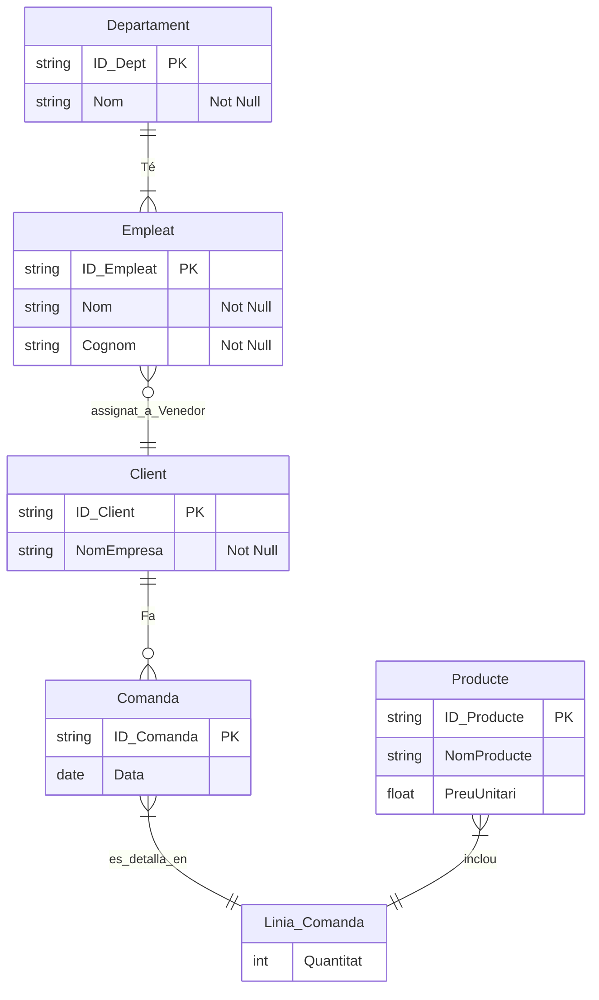

```mermaid
erDiagram
%% Los nombres y apellidos pueden o no, depende de mi, llevar el ("Not Null")
Departament ||--|{ Empleat: Té 
Empleat }o--|| Client: assignat_a_Venedor
Client ||--o{ Comanda: Fa
Comanda }|--|| Linia_Comanda: es_detalla_en
Producte }|--|| Linia_Comanda: inclou
Departament {
    string ID_Dept PK
    string Nom "Not Null"
}
Empleat {
    string ID_Empleat PK
    string Nom "Not Null"
    string Cognom "Not Null"
}
Client {
    string ID_Client PK
    string NomEmpresa "Not Null"
}
Comanda {
    string ID_Comanda PK
    date Data
}
Linia_Comanda {
    int Quantitat
}
Producte {
    string ID_Producte PK
    string NomProducte 
    float PreuUnitari
}
```
